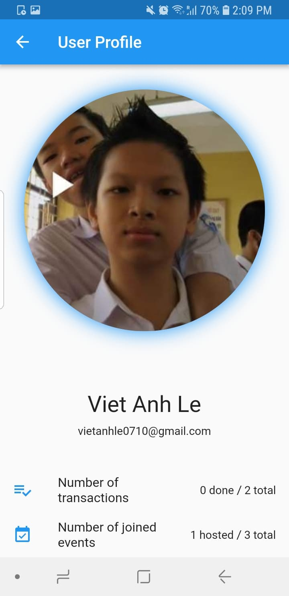
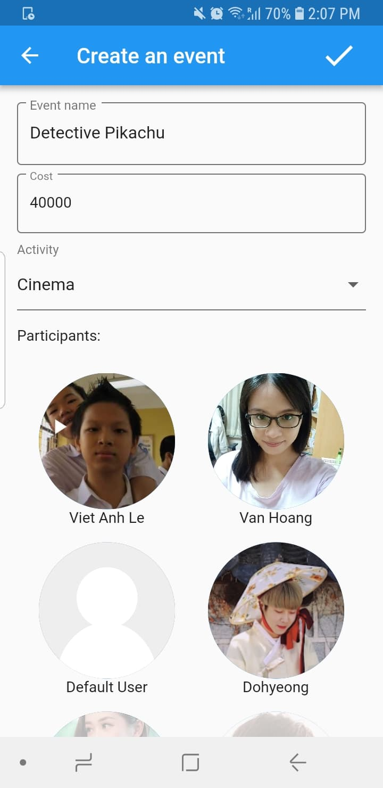
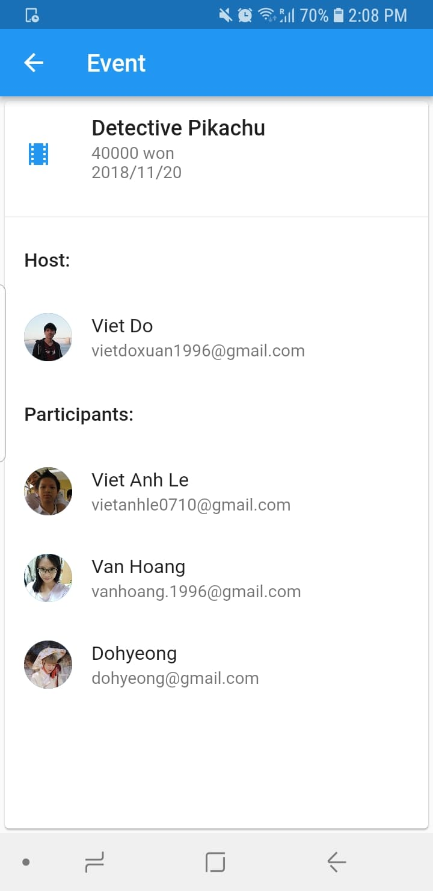
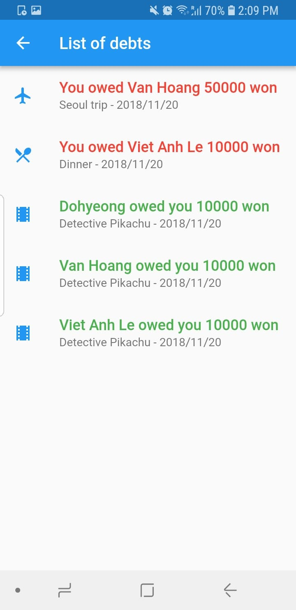

# Project milestone 4: High-Fi Prototype
Team: DebNet

Members:
1. Viet Do - 20160736 - doxuanviet1996@kaist.ac.kr
2. Anh Le - 20170763 - vietanhle@kaist.ac.kr
3. Van Hoang - 20160738 - vanhoang@kaist.ac.kr
4. Dohyeong Kim - 20160076 - lastnone@kaist.ac.kr

## Project Summary

The debts connection among a group of friends can be quite complex, due to occasions like eating, movies, etc. and one person pays everything and others will repay later. DebNet helps manage this connections by summarizing the total amount of money, memorizing the events and listing the debts. Furthermore, DebNet has unique user profile where statistics (e.g. number of transactions) are showed.
## Instruction
Since this is our prototype, we still did not support to create new user. Therefore, please click the menu button on the top left corner and switch to "Default User" by selecting the default user avatar on the top right corner of the menu tab. 
Afterthat, you can have a quick view into the "Friend list " tab since the other tabs do not have any data yet. This tab listed all the users we have created in the database. You can click on the avatar pictures to see the profile of each user. 

 User Profile 

  

Then, go back to the main screen and start creating new event by clicking the plus button on the bottom right corner. Fill in the field "Event name", "Cost", select the type of activity that matches with the name of the event, select participants for the event and click done button on the top right corner to finish creating an event.

 Event creation 

  

Next, you can switch to accounts of the participants that you added to the event to see changes in their pages (note that we only allow to switch 4 user accounts now so please add at least 1 of them to your event that you create) such as in notification, list of debts, list of events tab. 

 A particular event 

  

Now, in the "List of debts" tab, users can remind other users to make payment or notify other users that they have done the payment by clicking to the event and select the options that appear on the screen.

 Debts List 

  

Users can also can check events they have joined in "List of events" tab and check the payments they have done in the "Payment History".

## Prototype

The project is built as an mobile app, and unfortunately we can't export the project to a web version. Please download the apk file to your phone and install it to test the prototype. Sorry for the inconvenience.
**Download link:** https://github.com/doxuanviet1996/debnet/blob/master/debnet.apk
*Please let us know if there is any version problem. We have tested it on several phones and it worked fine, however we are not absolutely sure that it will work properly on your phone.*

## Git repository

Link: https://github.com/doxuanviet1996/debnet/

## Libraries and Frameworks

- The high-fi prototype was built by using a mobile app SDK called **Flutter**. Flutter provides an easy way to build beautiful native apps by using it high level libraries, consisting of numerous widgets.
- Flutter uses Dart language, an object-oriented language similar to Java.
- More details about Flutter can be found at https://flutter.io/

## Individual Reflections

1. **Viet Do**
    - **Contribution**: I built the 'fake' database where data are generated, defined database classes that are used in our implementation like 'user', 'event', 'notification', etc. I am also responsible for synchronizing the data into the frontend part, similar to querying to a database, except that data are manipulated and read/write directly. Besides, because I have experience working with Flutter, I helped others in learning the framework and answering questions related to coding details (e.g. when to use what widgets, what widgets would give the visualization that we wanted, etc.).
    - **Difficulties**: Managing data and passing it into front end is not easy, and it is also the most buggy part in implementing the project. Unlike frontend where changes and potential bugs can be seen visually, bugs in database require higher debugging skill and is harder to code. Furthermore, this is my first time building a mobile app, so the difficulties also come from exporting the app. Initially our plan was to upload it to Google Store, however that requires signing and verifying, so in the end we can only export it in to an *apk* file.
    - **Most useful skill learned**: While building the prototype, the most valuable skill I obtained is defining the database for a project. In our project, I have to consider carefully which classes should be build and how can one affects another. Defining a database that is effective, fully-functional, yet simple and easy to understand is not easy. Our project is quite small, so the database is fairly easy for me to organize, however in larger project I believe that it can be a very challenging problem.
2. **Viet Anh Le**
    - **Contribution**: I designed and developed the UI part which then can combine with the data in the database. I have designed and developed the UI for parts such as "List of events", "Friend list","Event Creation", etc. 
    - **Difficulties**: Since we built our prototype with Flutter which is a new language with me, I have faced some difficulties. First, I have to learned and got familiar with the new framework. Also, I have to learn new syntax which is not similar or has the same logic with other languages I have known before. The next challenge is about designing the UI which I have to do as close as possible with our Low-fi prototype. We have cut out the "add friend" option since it is quite hard to manage that for both frontend and backend part 
    - **Most useful skill learned**: While developing the prototype, the most valuable skill I have learnt is using Flutter to design and develop frontend part for an application. For this part, I have learnt new language as well as got familiar with the new framework which is very interesting to build an app. Also, I need to consider how to design features that can help to simplify the task for backend developer.
4. **Van Hoang**
    - **Contribution**: I designed and worked with Viet Anh to develop the UI part for our app. My part is designing and developing the UI for “List of debt” and “Payment history”
    - **Difficulties**: This is my first time using Flutter to build our prototype, so I have to learn and become familiar with the framework in a short time (about one week). Also, there were many bugs occurred when coding, which caused some difficulties for me while trying to fix them.
    - **Most useful skill learned**: Through building the prototype, I have learnt how to design and develop the front-end part for an application. I also learn a new programming language and framework, which is very useful and effective for building a mobile app.

6. **Dohyeong Kim**
    - **Contribution**: I have been in charge if marketing, si I recruited the users in KAIST for testing our application. And I helped some design problems by planning the structure of application
    - **Difficulties**: In marketing part, it was a little bit hard to advertise this new application to my friends. I realized the reality of advertisement when I started advertising this new product. And after that, a harder problem was there: to make real "network" between the users inside our application. Because our application needs meaningful network between users, we have to make the relationship and make some events for them to activate our application. 
    - **Most useful skill learned**: Since we started to design overall structure, I have learnt the skill for planning the entire project. Because this semester is the first semester with the real project, I can learn how to plan the overall project at the beginning, how to jump to the next steps. Especially, I know there are many tools for starting the project, like Flutter. It helps us design the main part of our project.
