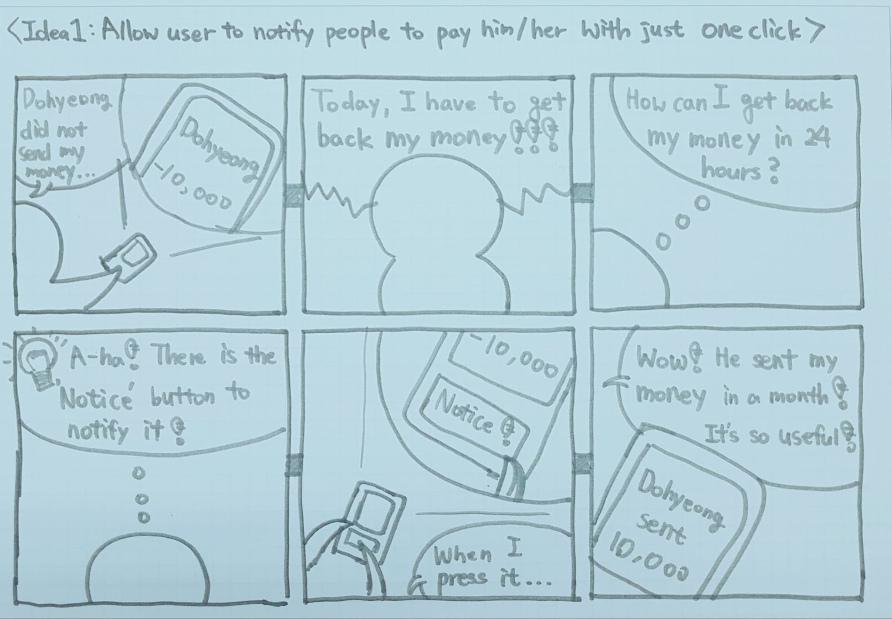
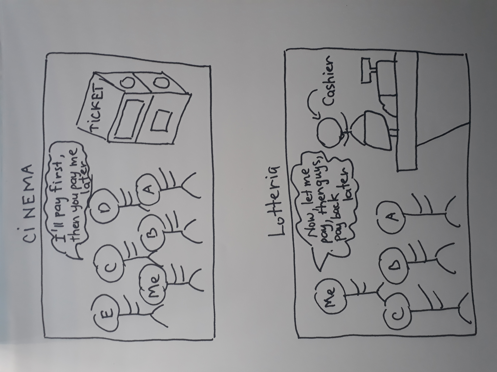
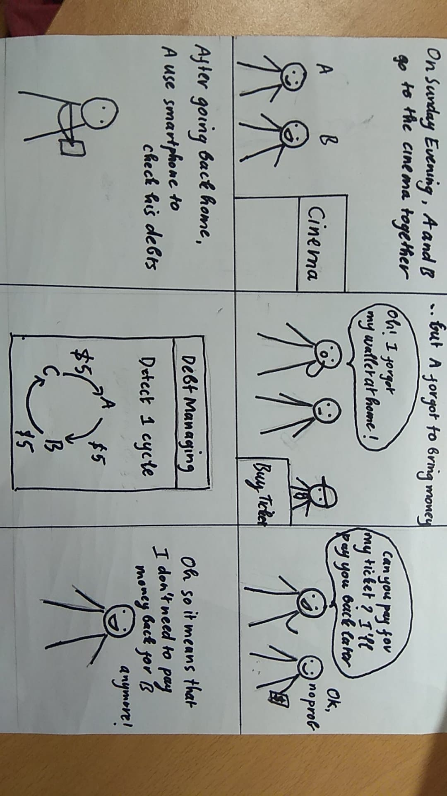

# Project milestone 1: Ideation
Team: 9420 

Members:
1. Viet Do - 20160736 - doxuanviet1996@kaist.ac.kr
2. Anh Le - 20170763 - vietanhle@kaist.ac.kr
3. Van Hoang - 20160738 - vanhoang@kaist.ac.kr
4. Dohyeong Kim - 20160076 - lastnone@kaist.ac.kr
## Problem statement
Represent and simplify the debt network between a group of friends.
## Problem background
When a group of friends go out together for eating, drinking, watching movies, etc., sometimes they let just one person pay all the cost and then send the money to that person later. However this 'later' part normally is pretty hard to manage - the one who paid has to keep track of who has sent him/her the money, and who has not, and then tell them that they have forgotten to pay. It is a very tedious work, especially when people are passive in sending the money, and the debts can get really complicated when there are multiple events, and people starting to 'transfer' the debt (for example, A owe B, B owe C, then A will owe C, etc.). The debt network that we are about to build will be able to help simplify the problem by managing the debt network for each person, so that the entire process can be done shortly in just some clicks.
## Motivation
From our point of view, everyone will have this kind of connection with their friends, and it is always troublesome, time consuming, and inconvenience to ask each one to pay the money to you (it can break friendship too..). Furthermore, by delaying the money sent/received, it is hard for one to manage their income financially, since they don't know exactly how much money they have. The problem can't be solved just with machine power or experts, since there are interactions between users (add debt, remove debt, payment authorization, etc.), so the solution should depends a lot on user's actions. The problem involved a lot of connections and interactions between people, so the solution that we propose is social computing.
## HMW questions
1. How might we represent and simplify the network?
2. How might we save time and money for user?
3. How might we help user manage his/her money financially?
4. How might we detect scammer/fraud who refuse to pay?
5. How might we notify people who forget to pay, to pay?
6. How might we authorize the payment?
7. How might we pay bills with the network?
8. How might we convince people to use the network?
9. How might we link the network with banks (real money)?
10. How might we expand the network to a group of strangers?
11. How might we link the network to online banking/ online shopping?

## Top 3 HMW questions
1. How might we represent and simplify the network?
2. How might we save time and money for user?
3. How might we notify people who forget to pay, to pay?
## Solution ideas for your HMW questions (at least 10 x 3 HMWs)
- **How might we represent and simplify the network?**
    1. Draw a graph to represents the connections between users.
    2. Simplify the network by detecting cycles (A owe B, B owe C, C owe A), bridges (A owe B, B owe C => A owe C).
    3. Let user decide whether to simplify the network in ways we propose.
    4. Erase the point(user) that does not have any connections with other points(users).
    5. Allow user to choose the method to see the network (for example: by graph, by table, etc.).
    6. Have a list of events that user participated in.
   
   7. Allow user to choose to see the connection they have in general or in specific events.
    8. Represents connection with red/green link based on whether it is income or outcome.
    9. Divide the graph node into 2 sides: the left one is the one has to pay user, and the right one is the one user has to pay to.
    10. Propose simplifications to user as graph with minimal nodes (for example if we want to simplify the cycle A->B->C->A, we show only 3 nodes to user).
- **How might we save time and money for users?**
    1. Set the limit for income/outcome each month so that user does not spend too much.
    2. Calculate the amount of money that they need to pay to others for them.
    3. Calculate the amount of money that other people owe the user.
    4. Calculate the net money (income - outcome).
    5. Minimize the number of transactions users need to do.
    6. By registering the account of each users, make the users pay immediately.
    7. Automatically notify user to pay debt (benefit debt owner).
    8. Build an e-wallet on the system, so user does not have to make external transactions, which takes more time.
    9. Allow payment by cash (both users have to agree to remove the debt).
    10. Allow users to know the total amount of money they have spent on those kinds of activities in certain period.
    11. Allow user to modify the network by redirecting the money owe/in debt. Require confirmation from everyone involved.
- **How might we notify people who forget to pay, to pay?**
    1. Allow user to notify people to pay him/her with just one click.
    2. Color 'complete' event with green, 'incomplete' event with red, so user knows which one are not fully paid.
    3. Give owner the ability to mark people who does not pay upon deadline as 'untrustworthy', so others will know.
    4. Record the time spent for paying someone's debt.
    5. Set the reminder for people who owe money everyweek.
    6. Allow direct message on the system, so users can talk about the dept there.
    7. Set the deadline for the payment.
    8. Let debt have interest, so the more people delay the payment, the more they have to pay.
    9. Set the limit for how much can an user be in debt.
    10. Record the number of events each user pay in time (build a trustworthy level - people who often forget to pay will have that reflected in their profile).
## Top 3 solution ideas
1. Allow user to notify people to pay him/her with just one click.
2. Show a list of events an user participated in.
3. Simplify the network by detecting cycles (A owe B, B owe C, C owe A), bridges (A owe B, B owe C => A owe C).

## Storyboards
### Solution 1

### Solution 2

### Solution 3

