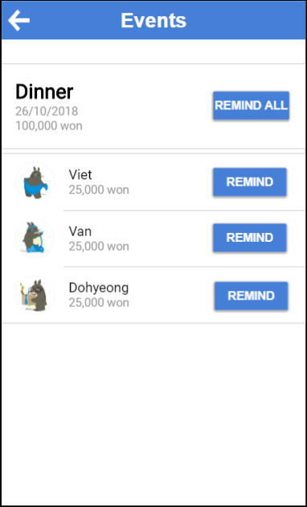

# Project milestone 3: Low-Fi Prototype
Team: DebNet

Members:
1. Viet Do - 20160736 - doxuanviet1996@kaist.ac.kr
2. Anh Le - 20170763 - vietanhle@kaist.ac.kr
3. Van Hoang - 20160738 - vanhoang@kaist.ac.kr
4. Dohyeong Kim - 20160076 - lastnone@kaist.ac.kr

## Problem statement
In a group of friends, there are occasions where they go to an event together (dinner, movie, coffee, etc), and only one person pays for all the cost, and the debt will be paid later. However in reality, the debts will piled up as people delay the payments, and one can easily forget how much money other people owe them (or they owe other people). Asking people to pay money is also an awkward conversation. Even worse, some people are mean and will not pay the money back.
## Tasks
1. Memorize the debts that an user has by creating events that they participated in.
2. Remind people who owe money to user, so that they do not forget about the debt.
3. Mark people who do not pay back as untrustworthy publicly, so that other people know about the bad guys and do not lend them money.
## Prototype
Test our prototype at https://pr.to/U2IJD8/
### Prototype tool
We use https://proto.io to build our low-fi prototype. The website is very easy to used with visualize objects like textbox, button, rectangle, and advanced objects like lists, etc., and we can create transition and interaction with them. The entire prototype can be done just by drawing on the website, no coding involved. Furthermore, although the website does not support direct collaboration, we can still work together by creating multiple projects and copy what we have built to the main project. However, the downside is the logic the interaction (which screen go to which), is pretty complex. There are also things that are very easy to code, but not easy to do on this proto.io site, i.e. showing a list from variables. Overall, the tool supports us with enough feature to build the low-fi prototype.
### Design choices
The minimal number of pages that we have to build for our app to operate normally: 
1. Main page: Show the amount of money user has, and also links to other pages.
2. Event creation page: Support the first task, and also the only place to add debts to the network (which is the core of our app!!), by organizing an event.
3. List of events page: Show a list of events that user participated in (as either payer or loaner), for user to manage their debt and remind people to pay.
4. Friend page: Show a list of friends of user, and also the page for displaying the statistic of each user (trust level, for example).
5. Notification: To show notification when people pay user, people add user to events, etc.
6. List of debts: Another place for user to access list of all debts, and also the place to remind people to pay money, and the place for user to pay money to events they are in.

However, there are some features which are not implemented in the low-fi:

1. The actual scale and relative ratio between buttons, bars, font are not perfectly chosen. The reason is that will take tons of time, while this is just a low-fi prototype - when we make the high-fi version, the framework will support us in this task.
2. The message system is not implemented in the low-fi prototype, and we are unsure whether we will implement it or not in the high-fi one. Building the system is pretty complex, and the result is not even in one of our tasks.
3. The low-fi prototype does not support user to pay money, since it is not in one of our task. However the task is also critical, and will be implemented in the high-fi one.

### Screenshots

  

 _Main screen_ 

  

 _Event creation_ 

  

 _A particular event_ 

  

 _User profile page_ 

### Scenario
In order to test our prototype, a scenario is given as follows:
In this story you are Viet Anh. Your team just went out for dinner together, and you are the one to pay all the cost of 20000 won. You decided to use the app to create the event and set up the debt. 
After a while, Dohyeong paid you back the money. You wanted the other two to pay back the money, so you reminded them. After reminding, Van remembered about the debt and paid you the money.
Still, after several days, Viet didn't make the payment, so you want to make him as untrusworthy on the app.
### Instruction
From the scenario, the following actions need to be done:
1. Create a new event. Give it the name "dinner", enter the money and add participants: Van, Viet, Dohyeong. (Vietanh is in by default).
2. Return to main page. See that Dohyeong already made the payment.
3. Notify Viet and Van to pay.
4. Wait a while. You will receive a notification that Van has made the payment.
5. Viet does not seem like he's going to pay back. Go mark him as untrustworthy.
## Observations
The following usability problems are listed by tasks:
### Task 1: Creating event
1. **[Criticality - Medium - P1, P2]**: Do not have who is the payer for the event in the tab "List of events" after users create a new event.
=> By default, the event creator is the payer. We can fix this in High-fi prototype by adding the "Payer" field to indicate this.
2. **[Criticality - Medium - P1, P3]**: People can complete an event without choosing any participants, dates and amount of money.
=> This is a problem of low-fi prototype. Adding such restriction is hard with just the tool we have. However, this can be fixed quite easily in the high-fi.
3. **[Criticality - High - P1]**: There's no way for user to search for a person to add while creating event, in case the friend list is too large.
=> This is quite hard to implement in this Low-fi prototype. In the High-fi prototype, because searching is not easy to build. We can try implementing this task which can help users add participants easier, especially when user has lots of friends.
### Task 2: Remind people to pay back
4. **[Criticality - High - P1, P2, P3]**: People go to "Friends" tab to find reminder but we design it in list of debts tab
=> We will put the "reminder messages" to the "Friends" tab. For each friend, a list of debts between user and this friend will be displayed.
5. **[Criticality - Medium - P2, P3]**: People still can click "Remind" button in the "List of events" tab even after transactions are completed.
=> We will solve this problem by disabling that button after the transactions among them are completed.
6. **[Criticality - Low - P1, P2, P3]**: "Approve All" button is not working.
=> We did not add this because now is just Low-fi prototype so we just do with notifications that will come seperately. We will deal with it later in the High-fi prototype when notifications will come simultaneously.
7. **[Criticality - Medium - P1, P3]**: In the list of events tab, user cannot see whether an event is completely paid or not.
=> We will fix it by adding marks that make users easily know that all the transactions in the events are completed or not (for example, we can add tick marks on the right side of completed events)
8. **[Criticality - Low - P1, P3]**: The list showing notifications of people paying back is not displaying date.
=> The problem can be solved easily by adding a date subtitle in each notification.
### Task 3: Mark bad people as untrustworthy
9. **[Criticality - Low - P3]**: People can mark users as trustworthy or untrustworthy before they do the payment
=> We will allow users to mark others only after the transactions are completed or users have reminded others for certain times.
10. **[Criticality - Low - P3]**: User cannot unmark a person as trustworthy or untrustworthy.
=> We will provide this in high-fi prototype by allowing users to unmark others because they may complete the transacstions after they are marked as untrustworhty.